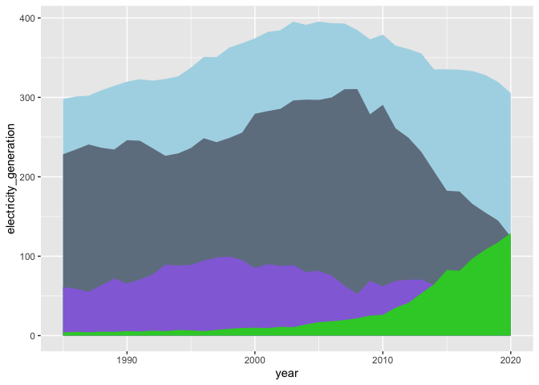

Playing around with Our World in Data Energy Dataset
================
Natalie Gable
4/12/2021

  - [Data Import](#data-import)
  - [EDA](#eda)
  - [Refining some ideas](#refining-some-ideas)
  - [Final visualizations](#final-visualizations)

## Data Import

``` r
owid_df <- 
  owid_filename %>% 
  read_delim(
    delim = ',',
    col_types = cols(
      carbon_intensity_elec = col_double()
    )
  )
```

## EDA

``` r
owid_df %>% 
  summary()
```

    ##    iso_code           country               year      coal_prod_change_pct
    ##  Length:17432       Length:17432       Min.   :1900   Min.   : -100.00    
    ##  Class :character   Class :character   1st Qu.:1946   1st Qu.:   -1.53    
    ##  Mode  :character   Mode  :character   Median :1983   Median :    0.00    
    ##                                        Mean   :1973   Mean   :   20.83    
    ##                                        3rd Qu.:2002   3rd Qu.:    7.69    
    ##                                        Max.   :2020   Max.   :44965.75    
    ##                                                       NA's   :9987        
    ##  coal_prod_change_twh gas_prod_change_pct  gas_prod_change_twh
    ##  Min.   :-2326.870    Min.   :-1.000e+02   Min.   :-1054.320  
    ##  1st Qu.:    0.000    1st Qu.: 0.000e+00   1st Qu.:    0.000  
    ##  Median :    0.000    Median : 3.000e+00   Median :    0.000  
    ##  Mean   :    8.798    Mean   : 1.922e+14   Mean   :   14.369  
    ##  3rd Qu.:    0.334    3rd Qu.: 1.000e+01   3rd Qu.:    2.559  
    ##  Max.   : 3060.593    Max.   : 9.343e+17   Max.   : 2112.975  
    ##  NA's   :7038         NA's   :12570        NA's   :9539       
    ##  oil_prod_change_pct oil_prod_change_twh energy_cons_change_pct
    ##  Min.   : -100.000   Min.   :-2239.737   Min.   :-92.632       
    ##  1st Qu.:   -1.429   1st Qu.:    0.000   1st Qu.: -0.431       
    ##  Median :    0.278   Median :    0.000   Median :  2.567       
    ##  Mean   :   18.242   Mean   :   18.034   Mean   :    Inf       
    ##  3rd Qu.:    9.091   3rd Qu.:    3.222   3rd Qu.:  6.876       
    ##  Max.   :25500.000   Max.   : 2790.614   Max.   :    Inf       
    ##  NA's   :10911       NA's   :8867        NA's   :7590          
    ##  energy_cons_change_twh biofuel_share_elec biofuel_elec_per_capita
    ##  Min.   :-6083.407      Min.   : 0.000     Min.   :   0.000       
    ##  1st Qu.:   -0.044      1st Qu.: 0.000     1st Qu.:   0.000       
    ##  Median :    0.736      Median : 0.021     Median :   0.136       
    ##  Mean   :   36.853      Mean   : 1.549     Mean   :  61.631       
    ##  3rd Qu.:   10.328      3rd Qu.: 1.363     3rd Qu.:  26.055       
    ##  Max.   : 6446.809      Max.   :33.912     Max.   :2337.538       
    ##  NA's   :7540           NA's   :13226      NA's   :13243          
    ##  biofuel_cons_change_pct biofuel_share_energy biofuel_cons_change_twh
    ##  Min.   :-100.000        Min.   :0.000        Min.   :-20.295        
    ##  1st Qu.:   0.476        1st Qu.:0.000        1st Qu.:  0.000        
    ##  Median :  10.499        Median :0.000        Median :  0.000        
    ##  Mean   :  53.993        Mean   :0.093        Mean   :  0.504        
    ##  3rd Qu.:  31.588        3rd Qu.:0.000        3rd Qu.:  0.000        
    ##  Max.   :5620.336        Max.   :7.863        Max.   :145.598        
    ##  NA's   :16913           NA's   :13148        NA's   :11923          
    ##  biofuel_consumption biofuel_cons_per_capita carbon_intensity_elec
    ##  Min.   :   0.000    Min.   :   0.00         Min.   :  11.0       
    ##  1st Qu.:   0.000    1st Qu.:   0.00         1st Qu.: 190.0       
    ##  Median :   0.000    Median :   0.00         Median : 353.0       
    ##  Mean   :   5.831    Mean   :  25.85         Mean   : 394.1       
    ##  3rd Qu.:   0.000    3rd Qu.:   0.00         3rd Qu.: 515.0       
    ##  Max.   :1101.949    Max.   :1765.81         Max.   :1116.0       
    ##  NA's   :11806       NA's   :11806           NA's   :16844        
    ##  coal_share_elec  coal_cons_change_pct coal_share_energy coal_cons_change_twh
    ##  Min.   :  0.00   Min.   : -100.00     Min.   : 0.000    Min.   :-1110.262   
    ##  1st Qu.:  0.00   1st Qu.:   -5.25     1st Qu.: 2.006    1st Qu.:   -1.033   
    ##  Median :  0.00   Median :    1.19     Median :11.035    Median :    0.000   
    ##  Mean   : 17.62   Mean   :   29.73     Mean   :17.764    Mean   :   12.479   
    ##  3rd Qu.: 24.29   3rd Qu.:    7.73     3rd Qu.:26.766    3rd Qu.:    3.896   
    ##  Max.   :523.08   Max.   :55400.00     Max.   :89.158    Max.   : 2551.865   
    ##  NA's   :12376    NA's   :13670        NA's   :13148     NA's   :13225       
    ##  coal_consumption   coal_elec_per_capita coal_cons_per_capita
    ##  Min.   :    0.00   Min.   :   0.0       Min.   :    0.0     
    ##  1st Qu.:    2.37   1st Qu.:   0.0       1st Qu.:  223.6     
    ##  Median :   31.79   Median :   0.0       Median : 2425.6     
    ##  Mean   :  894.62   Mean   : 628.5       Mean   : 5920.5     
    ##  3rd Qu.:  200.21   3rd Qu.: 482.8       3rd Qu.: 8249.0     
    ##  Max.   :44993.47   Max.   :9110.1       Max.   :96109.7     
    ##  NA's   :12262      NA's   :12673        NA's   :13142       
    ##  coal_production    coal_prod_per_capita electricity_generation
    ##  Min.   :    0.00   Min.   :     0.0     Min.   :    0.000     
    ##  1st Qu.:    0.00   1st Qu.:     0.0     1st Qu.:    1.935     
    ##  Median :    0.29   Median :    13.8     Median :   17.280     
    ##  Mean   :  471.21   Mean   :  3445.2     Mean   :  303.016     
    ##  3rd Qu.:   42.73   3rd Qu.:  1886.8     3rd Qu.:   71.795     
    ##  Max.   :46548.72   Max.   :150849.8     Max.   :25899.806     
    ##  NA's   :6803       NA's   :7779         NA's   :11313         
    ##  biofuel_electricity coal_electricity  fossil_electricity  gas_electricity   
    ##  Min.   :  0.000     Min.   :   0.00   Min.   :    0.000   Min.   :   0.000  
    ##  1st Qu.:  0.000     1st Qu.:   0.00   1st Qu.:    0.388   1st Qu.:   0.000  
    ##  Median :  0.001     Median :   0.00   Median :    5.621   Median :   1.138  
    ##  Mean   :  3.310     Mean   : 139.99   Mean   :  238.035   Mean   :  72.732  
    ##  3rd Qu.:  0.276     3rd Qu.:  17.81   3rd Qu.:   70.513   3rd Qu.:  26.856  
    ##  Max.   :586.179     Max.   :9345.34   Max.   :16233.117   Max.   :5943.112  
    ##  NA's   :13183       NA's   :12333     NA's   :12333       NA's   :12333     
    ##  hydro_electricity  nuclear_electricity oil_electricity   
    ##  Min.   :   0.000   Min.   :   0.00     Min.   :   0.000  
    ##  1st Qu.:   0.022   1st Qu.:   0.00     1st Qu.:   0.049  
    ##  Median :   1.986   Median :   0.00     Median :   1.029  
    ##  Mean   :  51.917   Mean   :  41.83     Mean   :  25.317  
    ##  3rd Qu.:  13.934   3rd Qu.:   0.00     3rd Qu.:   9.017  
    ##  Max.   :4355.042   Max.   :2720.67     Max.   :1364.578  
    ##  NA's   :11313      NA's   :11313       NA's   :12333     
    ##  other_renewable_electricity other_renewable_exc_biofuel_electricity
    ##  Min.   :  0.000             Min.   :  0.000                        
    ##  1st Qu.:  0.000             1st Qu.:  0.000                        
    ##  Median :  0.011             Median :  0.000                        
    ##  Mean   :  5.159             Mean   :  0.879                        
    ##  3rd Qu.:  0.670             3rd Qu.:  0.000                        
    ##  Max.   :702.888             Max.   :116.709                        
    ##  NA's   :11348               NA's   :13183                          
    ##  renewables_electricity solar_electricity wind_electricity   energy_per_gdp  
    ##  Min.   :   0.000       Min.   :  0.000   Min.   :   0.000   Min.   : 0.050  
    ##  1st Qu.:   0.084       1st Qu.:  0.000   1st Qu.:   0.000   1st Qu.: 0.842  
    ##  Median :   2.785       Median :  0.000   Median :   0.000   Median : 1.395  
    ##  Mean   :  64.331       Mean   :  1.701   Mean   :   5.217   Mean   : 1.838  
    ##  3rd Qu.:  17.426       3rd Qu.:  0.009   3rd Qu.:   0.047   3rd Qu.: 2.345  
    ##  Max.   :7492.505       Max.   :844.386   Max.   :1590.189   Max.   :13.493  
    ##  NA's   :11348          NA's   :11313     NA's   :11313      NA's   :10532   
    ##  energy_per_capita fossil_cons_change_pct fossil_share_energy
    ##  Min.   :      0   Min.   :-52.574        Min.   : 17.16     
    ##  1st Qu.:   3103   1st Qu.: -0.866        1st Qu.: 81.79     
    ##  Median :  13777   Median :  2.627        Median : 92.17     
    ##  Mean   :  29602   Mean   :  3.372        Mean   : 87.06     
    ##  3rd Qu.:  36714   3rd Qu.:  6.412        3rd Qu.: 97.95     
    ##  Max.   :1676610   Max.   :492.819        Max.   :100.00     
    ##  NA's   :8397      NA's   :13231          NA's   :13148      
    ##  fossil_cons_change_twh fossil_fuel_consumption fossil_energy_per_capita
    ##  Min.   :-2147.294      Min.   :     0.86       Min.   :   124.1        
    ##  1st Qu.:   -1.487      1st Qu.:   121.40       1st Qu.: 11247.6        
    ##  Median :    5.402      Median :   296.33       Median : 25509.7        
    ##  Mean   :   48.273      Mean   :  2737.59       Mean   : 32913.4        
    ##  3rd Qu.:   27.431      3rd Qu.:  1068.12       3rd Qu.: 40568.7        
    ##  Max.   : 5477.970      Max.   :136761.61       Max.   :317582.5        
    ##  NA's   :13231          NA's   :13148           NA's   :13148           
    ##  fossil_cons_per_capita fossil_share_elec gas_share_elec    gas_cons_change_pct
    ##  Min.   :    0.0        Min.   :  0.00    Min.   :  0.000   Min.   :  -95.245  
    ##  1st Qu.:  199.3        1st Qu.: 43.51    1st Qu.:  0.000   1st Qu.:   -0.569  
    ##  Median : 1323.3        Median : 77.18    Median :  8.176   Median :    4.164  
    ##  Mean   : 2419.3        Mean   : 75.70    Mean   : 23.626   Mean   :   22.388  
    ##  3rd Qu.: 3592.2        3rd Qu.: 98.13    3rd Qu.: 33.803   3rd Qu.:   11.085  
    ##  Max.   :20640.9        Max.   :806.12    Max.   :310.457   Max.   :15300.000  
    ##  NA's   :12673          NA's   :12376     NA's   :12376     NA's   :13728      
    ##  gas_share_energy gas_cons_change_twh gas_consumption    gas_elec_per_capita
    ##  Min.   : 0.00    Min.   :-613.301    Min.   :    0.00   Min.   :    0.00   
    ##  1st Qu.: 3.84    1st Qu.:   0.000    1st Qu.:    7.86   1st Qu.:    0.00   
    ##  Median :15.84    Median :   1.372    Median :   51.69   Median :   62.33   
    ##  Mean   :20.81    Mean   :  17.541    Mean   :  665.60   Mean   :  907.40   
    ##  3rd Qu.:30.50    3rd Qu.:  10.006    3rd Qu.:  259.31   3rd Qu.:  767.68   
    ##  Max.   :90.74    Max.   :2195.737    Max.   :39292.47   Max.   :20611.25   
    ##  NA's   :13148    NA's   :13225       NA's   :12262      NA's   :12673      
    ##  gas_energy_per_capita gas_production     gas_prod_per_capita hydro_share_elec 
    ##  Min.   :     0.0      Min.   :    0.00   Min.   :     0      Min.   :  0.000  
    ##  1st Qu.:   443.8      1st Qu.:    0.00   1st Qu.:     0      1st Qu.:  0.222  
    ##  Median :  4082.9      Median :    0.21   Median :     0      Median : 12.520  
    ##  Mean   : 10255.9      Mean   :  457.56   Mean   : 11184      Mean   : 26.510  
    ##  3rd Qu.: 10359.9      3rd Qu.:  104.64   3rd Qu.:  2240      3rd Qu.: 48.554  
    ##  Max.   :278892.4      Max.   :39893.38   Max.   :740193      Max.   :100.000  
    ##  NA's   :13142         NA's   :9366       NA's   :10092       NA's   :11356    
    ##  hydro_cons_change_pct hydro_share_energy hydro_cons_change_twh
    ##  Min.   : -80.585      Min.   : 0.000     Min.   :-266.952     
    ##  1st Qu.:  -6.174      1st Qu.: 0.522     1st Qu.:  -0.470     
    ##  Median :   2.413      Median : 4.084     Median :   0.006     
    ##  Mean   :   6.051      Mean   : 8.625     Mean   :   3.925     
    ##  3rd Qu.:  12.064      3rd Qu.:10.854     3rd Qu.:   2.350     
    ##  Max.   :1750.000      Max.   :71.055     Max.   : 477.238     
    ##  NA's   :13768         NA's   :13148      NA's   :13225        
    ##  hydro_consumption   hydro_elec_per_capita hydro_energy_per_capita
    ##  Min.   :    0.000   Min.   :    0.00      Min.   :     0.00      
    ##  1st Qu.:    1.377   1st Qu.:    1.62      1st Qu.:    85.19      
    ##  Median :   13.584   Median :  116.79      Median :   576.74      
    ##  Mean   :  195.805   Mean   :  990.13      Mean   :  3606.96      
    ##  3rd Qu.:   73.785   3rd Qu.:  658.68      3rd Qu.:  2124.32      
    ##  Max.   :10455.127   Max.   :41592.81      Max.   :105642.71      
    ##  NA's   :13142       NA's   :11933         NA's   :13142          
    ##  low_carbon_share_elec low_carbon_electricity low_carbon_elec_per_capita
    ##  Min.   :  0.000       Min.   :    0.000      Min.   :    0.0           
    ##  1st Qu.:  3.663       1st Qu.:    0.084      1st Qu.:   16.8           
    ##  Median : 27.721       Median :    3.720      Median :  234.3           
    ##  Mean   : 35.236       Mean   :  106.400      Mean   : 1571.5           
    ##  3rd Qu.: 61.125       3rd Qu.:   23.894      3rd Qu.: 1419.3           
    ##  Max.   :100.000       Max.   :10109.117      Max.   :57655.8           
    ##  NA's   :11391         NA's   :11348          NA's   :11933             
    ##  low_carbon_cons_change_pct low_carbon_share_energy low_carbon_cons_change_twh
    ##  Min.   : -92.152           Min.   : 0.000          Min.   :-383.227          
    ##  1st Qu.:  -1.982           1st Qu.: 2.020          1st Qu.:  -0.128          
    ##  Median :   3.880           Median : 7.825          Median :   0.366          
    ##  Mean   :  12.326           Mean   :12.895          Mean   :  12.933          
    ##  3rd Qu.:  12.269           3rd Qu.:18.138          3rd Qu.:   5.382          
    ##  Max.   :8345.716           Max.   :82.835          Max.   :1174.696          
    ##  NA's   :13597              NA's   :13148           NA's   :13225             
    ##  low_carbon_consumption low_carbon_energy_per_capita nuclear_share_elec
    ##  Min.   :    0.000      Min.   :     0.0             Min.   : 0.000    
    ##  1st Qu.:    3.259      1st Qu.:   198.2             1st Qu.: 0.000    
    ##  Median :   30.508      Median :  1185.7             Median : 0.000    
    ##  Mean   :  399.489      Mean   :  5636.1             Mean   : 5.149    
    ##  3rd Qu.:  130.904      3rd Qu.:  5047.5             3rd Qu.: 0.000    
    ##  Max.   :25427.562      Max.   :146224.5             Max.   :86.920    
    ##  NA's   :13142          NA's   :13142                NA's   :11356     
    ##  nuclear_cons_change_pct nuclear_share_energy nuclear_cons_change_twh
    ##  Min.   : -100.000       Min.   : 0.000       Min.   :-510.129       
    ##  1st Qu.:   -2.188       1st Qu.: 0.000       1st Qu.:   0.000       
    ##  Median :    2.604       Median : 0.000       Median :   0.000       
    ##  Mean   :   40.757       Mean   : 3.126       Mean   :   4.254       
    ##  3rd Qu.:   13.564       3rd Qu.: 2.122       3rd Qu.:   0.000       
    ##  Max.   :11200.000       Max.   :41.707       Max.   : 650.982       
    ##  NA's   :15910           NA's   :13148        NA's   :13225          
    ##  nuclear_consumption nuclear_elec_per_capita nuclear_energy_per_capita
    ##  Min.   :   0.00     Min.   :   0.0          Min.   :    0.0          
    ##  1st Qu.:   0.00     1st Qu.:   0.0          1st Qu.:    0.0          
    ##  Median :   0.00     Median :   0.0          Median :    0.0          
    ##  Mean   : 160.18     Mean   : 398.3          Mean   : 1480.3          
    ##  3rd Qu.:  29.72     3rd Qu.:   0.0          3rd Qu.:  637.7          
    ##  Max.   :7493.28     Max.   :8899.8          Max.   :24721.8          
    ##  NA's   :13142       NA's   :11933           NA's   :13142            
    ##  oil_share_elec    oil_cons_change_pct oil_share_energy  oil_cons_change_twh
    ##  Min.   :  0.000   Min.   :-73.921     Min.   :  5.053   Min.   :-1446.860  
    ##  1st Qu.:  1.595   1st Qu.: -1.649     1st Qu.: 34.167   1st Qu.:   -2.026  
    ##  Median : 12.478   Median :  2.406     Median : 45.080   Median :    2.663  
    ##  Mean   : 34.456   Mean   :  2.991     Mean   : 48.480   Mean   :   18.209  
    ##  3rd Qu.: 68.140   3rd Qu.:  6.838     3rd Qu.: 62.365   3rd Qu.:   12.985  
    ##  Max.   :267.855   Max.   :142.590     Max.   :100.000   Max.   : 2368.173  
    ##  NA's   :12376     NA's   :13231       NA's   :13148     NA's   :13231      
    ##  oil_consumption    oil_elec_per_capita oil_energy_per_capita
    ##  Min.   :    0.00   Min.   :    0.00    Min.   :   124.1     
    ##  1st Qu.:   67.64   1st Qu.:   16.11    1st Qu.:  5316.4     
    ##  Median :  154.23   Median :  148.94    Median : 12149.0     
    ##  Mean   : 1238.02   Mean   :  883.32    Mean   : 16714.3     
    ##  3rd Qu.:  512.24   3rd Qu.:  653.03    3rd Qu.: 22639.0     
    ##  Max.   :53619.93   Max.   :11933.94    Max.   :151237.3     
    ##  NA's   :12248      NA's   :12673       NA's   :13148        
    ##  oil_production     oil_prod_per_capita other_renewables_elec_per_capita
    ##  Min.   :    0.00   Min.   :      0     Min.   :    0.000               
    ##  1st Qu.:    0.00   1st Qu.:      0     1st Qu.:    0.000               
    ##  Median :    5.87   Median :    159     Median :    0.386               
    ##  Mean   :  875.01   Mean   :  46181     Mean   :  114.717               
    ##  3rd Qu.:  238.76   3rd Qu.:   7855     3rd Qu.:   42.501               
    ##  Max.   :52244.64   Max.   :3758746     Max.   :17495.575               
    ##  NA's   :8722       NA's   :9508        NA's   :11933                   
    ##  other_renewables_share_elec other_renewables_cons_change_pct
    ##  Min.   : 0.000              Min.   : -100.000               
    ##  1st Qu.: 0.000              1st Qu.:   -0.617               
    ##  Median : 0.070              Median :    5.085               
    ##  Mean   : 1.980              Mean   :   35.598               
    ##  3rd Qu.: 1.544              3rd Qu.:   16.092               
    ##  Max.   :49.047              Max.   :21131.333               
    ##  NA's   :11391               NA's   :15106                   
    ##  other_renewables_share_energy other_renewables_cons_change_twh
    ##  Min.   : 0.000                Min.   :-25.208                 
    ##  1st Qu.: 0.000                1st Qu.:  0.000                 
    ##  Median : 0.039                Median :  0.000                 
    ##  Mean   : 0.627                Mean   :  0.911                 
    ##  3rd Qu.: 0.442                3rd Qu.:  0.158                 
    ##  Max.   :24.594                Max.   : 99.421                 
    ##  NA's   :13148                 NA's   :13225                   
    ##  other_renewable_consumption other_renewables_energy_per_capita
    ##  Min.   :   0.000            Min.   :    0.00                  
    ##  1st Qu.:   0.000            1st Qu.:    0.00                  
    ##  Median :   0.128            Median :    7.23                  
    ##  Mean   :  16.449            Mean   :  351.50                  
    ##  3rd Qu.:   4.145            3rd Qu.:  154.25                  
    ##  Max.   :1614.027            Max.   :44322.65                  
    ##  NA's   :13142               NA's   :13142                     
    ##  per_capita_electricity   population        primary_energy_consumption
    ##  Min.   :    0.0        Min.   :2.000e+03   Min.   :     0.00         
    ##  1st Qu.:  641.3        1st Qu.:1.804e+06   1st Qu.:     7.52         
    ##  Median : 2521.3        Median :6.524e+06   Median :    67.26         
    ##  Mean   : 4016.8        Mean   :6.286e+07   Mean   :  1672.25         
    ##  3rd Qu.: 5591.0        3rd Qu.:2.011e+07   3rd Qu.:   388.86         
    ##  Max.   :57661.4        Max.   :7.713e+09   Max.   :162194.29         
    ##  NA's   :11933          NA's   :1756        NA's   :7298              
    ##  renewables_elec_per_capita renewables_share_elec renewables_cons_change_pct
    ##  Min.   :    0.00           Min.   :  0.000       Min.   : -92.641          
    ##  1st Qu.:   16.53           1st Qu.:  2.328       1st Qu.:  -3.175          
    ##  Median :  195.37           Median : 16.937       Median :   4.047          
    ##  Mean   : 1173.25           Mean   : 30.057       Mean   :  11.939          
    ##  3rd Qu.:  834.23           3rd Qu.: 54.643       3rd Qu.:  13.620          
    ##  Max.   :57655.79           Max.   :100.000       Max.   :8345.716          
    ##  NA's   :11933              NA's   :11391         NA's   :13604             
    ##  renewables_share_energy renewables_cons_change_twh renewables_consumption
    ##  Min.   : 0.000          Min.   :-260.135           Min.   :    0.00      
    ##  1st Qu.: 1.010          1st Qu.:  -0.185           1st Qu.:    2.37      
    ##  Median : 5.060          Median :   0.208           Median :   17.78      
    ##  Mean   : 9.769          Mean   :   8.679           Mean   :  239.31      
    ##  3rd Qu.:13.185          3rd Qu.:   3.513           3rd Qu.:   87.52      
    ##  Max.   :82.835          Max.   : 977.682           Max.   :18504.15      
    ##  NA's   :13148           NA's   :13225              NA's   :13142         
    ##  renewables_energy_per_capita solar_share_elec solar_cons_change_pct
    ##  Min.   :     0.0             Min.   : 0.000   Min.   : -100.000    
    ##  1st Qu.:   161.5             1st Qu.: 0.000   1st Qu.:    6.711    
    ##  Median :   727.6             Median : 0.000   Median :   26.070    
    ##  Mean   :  4155.7             Mean   : 0.402   Mean   :  135.206    
    ##  3rd Qu.:  2685.8             3rd Qu.: 0.057   3rd Qu.:   72.447    
    ##  Max.   :146224.5             Max.   :25.711   Max.   :11974.129    
    ##  NA's   :13142                NA's   :11356    NA's   :16107        
    ##  solar_share_energy solar_cons_change_twh solar_consumption 
    ##  Min.   :0.000      Min.   : -4.641       Min.   :   0.000  
    ##  1st Qu.:0.000      1st Qu.:  0.000       1st Qu.:   0.000  
    ##  Median :0.000      Median :  0.000       Median :   0.000  
    ##  Mean   :0.079      Mean   :  1.019       Mean   :   4.327  
    ##  3rd Qu.:0.001      3rd Qu.:  0.001       3rd Qu.:   0.010  
    ##  Max.   :3.593      Max.   :344.629       Max.   :1792.996  
    ##  NA's   :13148      NA's   :13225         NA's   :13142     
    ##  solar_elec_per_capita solar_energy_per_capita      gdp           
    ##  Min.   :  0.000       Min.   :   0.000        Min.   :1.963e+08  
    ##  1st Qu.:  0.000       1st Qu.:   0.000        1st Qu.:1.254e+10  
    ##  Median :  0.000       Median :   0.000        Median :4.282e+10  
    ##  Mean   : 14.777       Mean   :  29.375        Mean   :5.418e+11  
    ##  3rd Qu.:  0.794       3rd Qu.:   0.296        3rd Qu.:1.750e+11  
    ##  Max.   :825.094       Max.   :1763.675        Max.   :1.070e+14  
    ##  NA's   :11933         NA's   :13142           NA's   :6976       
    ##  wind_share_elec  wind_cons_change_pct wind_share_energy wind_cons_change_twh
    ##  Min.   : 0.000   Min.   :  -100.00    Min.   : 0.000    Min.   :-10.409     
    ##  1st Qu.: 0.000   1st Qu.:     2.16    1st Qu.: 0.000    1st Qu.:  0.000     
    ##  Median : 0.000   Median :    19.75    Median : 0.000    Median :  0.000     
    ##  Mean   : 1.006   Mean   :   313.48    Mean   : 0.345    Mean   :  2.164     
    ##  3rd Qu.: 0.108   3rd Qu.:    50.00    3rd Qu.: 0.020    3rd Qu.:  0.010     
    ##  Max.   :56.338   Max.   :242384.84    Max.   :20.660    Max.   :428.736     
    ##  NA's   :11356    NA's   :15889        NA's   :13148     NA's   :13225       
    ##  wind_consumption   wind_elec_per_capita wind_energy_per_capita
    ##  Min.   :   0.000   Min.   :   0.000     Min.   :   0.000      
    ##  1st Qu.:   0.000   1st Qu.:   0.000     1st Qu.:   0.000      
    ##  Median :   0.000   Median :   0.000     Median :   0.000      
    ##  Mean   :  15.081   Mean   :  53.626     Mean   : 134.003      
    ##  3rd Qu.:   0.141   3rd Qu.:   3.046     3rd Qu.:   4.745      
    ##  Max.   :3540.051   Max.   :2825.425     Max.   :6928.363      
    ##  NA's   :13142      NA's   :11933        NA's   :13142

What are countries that have fewer NAs?

``` r
owid_df %>% 
  drop_na() %>% 
  select(country) %>% 
  unique()
```

    ## # A tibble: 1 x 1
    ##   country       
    ##   <chr>         
    ## 1 United Kingdom

Only the UK has no NAs for some fields.

Let’s take a look at the US as well…

``` r
owid_df %>% 
  filter(iso_code == 'USA') %>% 
  map(~sum(is.na(.))) %>% 
  as_tibble() %>% 
  gather(key = 'variable', value = 'n_na') %>% 
  arrange(desc(n_na))
```

    ## # A tibble: 122 x 2
    ##    variable                                 n_na
    ##    <chr>                                   <int>
    ##  1 carbon_intensity_elec                     121
    ##  2 biofuel_share_elec                        100
    ##  3 biofuel_elec_per_capita                   100
    ##  4 biofuel_electricity                       100
    ##  5 other_renewable_exc_biofuel_electricity   100
    ##  6 biofuel_cons_change_pct                    92
    ##  7 coal_share_elec                            85
    ##  8 coal_elec_per_capita                       85
    ##  9 electricity_generation                     85
    ## 10 coal_electricity                           85
    ## # … with 112 more rows

We can see for many years, we don’t have data about the USA’s
electricity breakdown by source. Wde saw that the UK has more fields
without NAs. Let’s do the same thing for the UK.

``` r
owid_df %>% 
  filter(iso_code == 'GBR') %>% 
  map(~sum(is.na(.))) %>% 
  as_tibble() %>% 
  gather(key = 'variable', value = 'n_na') %>% 
  arrange(desc(n_na))
```

    ## # A tibble: 122 x 2
    ##    variable                                 n_na
    ##    <chr>                                   <int>
    ##  1 biofuel_cons_change_pct                   104
    ##  2 biofuel_share_elec                        100
    ##  3 biofuel_elec_per_capita                   100
    ##  4 carbon_intensity_elec                     100
    ##  5 biofuel_electricity                       100
    ##  6 other_renewable_exc_biofuel_electricity   100
    ##  7 solar_cons_change_pct                      97
    ##  8 other_renewables_cons_change_pct           92
    ##  9 wind_cons_change_pct                       91
    ## 10 coal_share_elec                            85
    ## # … with 112 more rows

Since the UK has fewer NAs, let’s play around with that data only.

``` r
uk_df <- 
  owid_df %>% 
  filter(iso_code == 'GBR')

uk_df %>% 
  colnames()
```

    ##   [1] "iso_code"                               
    ##   [2] "country"                                
    ##   [3] "year"                                   
    ##   [4] "coal_prod_change_pct"                   
    ##   [5] "coal_prod_change_twh"                   
    ##   [6] "gas_prod_change_pct"                    
    ##   [7] "gas_prod_change_twh"                    
    ##   [8] "oil_prod_change_pct"                    
    ##   [9] "oil_prod_change_twh"                    
    ##  [10] "energy_cons_change_pct"                 
    ##  [11] "energy_cons_change_twh"                 
    ##  [12] "biofuel_share_elec"                     
    ##  [13] "biofuel_elec_per_capita"                
    ##  [14] "biofuel_cons_change_pct"                
    ##  [15] "biofuel_share_energy"                   
    ##  [16] "biofuel_cons_change_twh"                
    ##  [17] "biofuel_consumption"                    
    ##  [18] "biofuel_cons_per_capita"                
    ##  [19] "carbon_intensity_elec"                  
    ##  [20] "coal_share_elec"                        
    ##  [21] "coal_cons_change_pct"                   
    ##  [22] "coal_share_energy"                      
    ##  [23] "coal_cons_change_twh"                   
    ##  [24] "coal_consumption"                       
    ##  [25] "coal_elec_per_capita"                   
    ##  [26] "coal_cons_per_capita"                   
    ##  [27] "coal_production"                        
    ##  [28] "coal_prod_per_capita"                   
    ##  [29] "electricity_generation"                 
    ##  [30] "biofuel_electricity"                    
    ##  [31] "coal_electricity"                       
    ##  [32] "fossil_electricity"                     
    ##  [33] "gas_electricity"                        
    ##  [34] "hydro_electricity"                      
    ##  [35] "nuclear_electricity"                    
    ##  [36] "oil_electricity"                        
    ##  [37] "other_renewable_electricity"            
    ##  [38] "other_renewable_exc_biofuel_electricity"
    ##  [39] "renewables_electricity"                 
    ##  [40] "solar_electricity"                      
    ##  [41] "wind_electricity"                       
    ##  [42] "energy_per_gdp"                         
    ##  [43] "energy_per_capita"                      
    ##  [44] "fossil_cons_change_pct"                 
    ##  [45] "fossil_share_energy"                    
    ##  [46] "fossil_cons_change_twh"                 
    ##  [47] "fossil_fuel_consumption"                
    ##  [48] "fossil_energy_per_capita"               
    ##  [49] "fossil_cons_per_capita"                 
    ##  [50] "fossil_share_elec"                      
    ##  [51] "gas_share_elec"                         
    ##  [52] "gas_cons_change_pct"                    
    ##  [53] "gas_share_energy"                       
    ##  [54] "gas_cons_change_twh"                    
    ##  [55] "gas_consumption"                        
    ##  [56] "gas_elec_per_capita"                    
    ##  [57] "gas_energy_per_capita"                  
    ##  [58] "gas_production"                         
    ##  [59] "gas_prod_per_capita"                    
    ##  [60] "hydro_share_elec"                       
    ##  [61] "hydro_cons_change_pct"                  
    ##  [62] "hydro_share_energy"                     
    ##  [63] "hydro_cons_change_twh"                  
    ##  [64] "hydro_consumption"                      
    ##  [65] "hydro_elec_per_capita"                  
    ##  [66] "hydro_energy_per_capita"                
    ##  [67] "low_carbon_share_elec"                  
    ##  [68] "low_carbon_electricity"                 
    ##  [69] "low_carbon_elec_per_capita"             
    ##  [70] "low_carbon_cons_change_pct"             
    ##  [71] "low_carbon_share_energy"                
    ##  [72] "low_carbon_cons_change_twh"             
    ##  [73] "low_carbon_consumption"                 
    ##  [74] "low_carbon_energy_per_capita"           
    ##  [75] "nuclear_share_elec"                     
    ##  [76] "nuclear_cons_change_pct"                
    ##  [77] "nuclear_share_energy"                   
    ##  [78] "nuclear_cons_change_twh"                
    ##  [79] "nuclear_consumption"                    
    ##  [80] "nuclear_elec_per_capita"                
    ##  [81] "nuclear_energy_per_capita"              
    ##  [82] "oil_share_elec"                         
    ##  [83] "oil_cons_change_pct"                    
    ##  [84] "oil_share_energy"                       
    ##  [85] "oil_cons_change_twh"                    
    ##  [86] "oil_consumption"                        
    ##  [87] "oil_elec_per_capita"                    
    ##  [88] "oil_energy_per_capita"                  
    ##  [89] "oil_production"                         
    ##  [90] "oil_prod_per_capita"                    
    ##  [91] "other_renewables_elec_per_capita"       
    ##  [92] "other_renewables_share_elec"            
    ##  [93] "other_renewables_cons_change_pct"       
    ##  [94] "other_renewables_share_energy"          
    ##  [95] "other_renewables_cons_change_twh"       
    ##  [96] "other_renewable_consumption"            
    ##  [97] "other_renewables_energy_per_capita"     
    ##  [98] "per_capita_electricity"                 
    ##  [99] "population"                             
    ## [100] "primary_energy_consumption"             
    ## [101] "renewables_elec_per_capita"             
    ## [102] "renewables_share_elec"                  
    ## [103] "renewables_cons_change_pct"             
    ## [104] "renewables_share_energy"                
    ## [105] "renewables_cons_change_twh"             
    ## [106] "renewables_consumption"                 
    ## [107] "renewables_energy_per_capita"           
    ## [108] "solar_share_elec"                       
    ## [109] "solar_cons_change_pct"                  
    ## [110] "solar_share_energy"                     
    ## [111] "solar_cons_change_twh"                  
    ## [112] "solar_consumption"                      
    ## [113] "solar_elec_per_capita"                  
    ## [114] "solar_energy_per_capita"                
    ## [115] "gdp"                                    
    ## [116] "wind_share_elec"                        
    ## [117] "wind_cons_change_pct"                   
    ## [118] "wind_share_energy"                      
    ## [119] "wind_cons_change_twh"                   
    ## [120] "wind_consumption"                       
    ## [121] "wind_elec_per_capita"                   
    ## [122] "wind_energy_per_capita"

What we have data about:

  - energy production
  - energy consumption
  - electricity use and breakdown by type
  - renewables (and breakdown)

<!-- end list -->

``` r
uk_df %>% 
  select(year, electricity_generation) %>% 
  ggplot(mapping = aes(x = year, y = electricity_generation)) +
  geom_line()
```

    ## Warning: Removed 85 row(s) containing missing values (geom_path).

<!-- -->

``` r
uk_df %>% 
  select_at(vars(contains('elec'))) %>% 
  colnames()
```

    ##  [1] "biofuel_share_elec"                     
    ##  [2] "biofuel_elec_per_capita"                
    ##  [3] "carbon_intensity_elec"                  
    ##  [4] "coal_share_elec"                        
    ##  [5] "coal_elec_per_capita"                   
    ##  [6] "electricity_generation"                 
    ##  [7] "biofuel_electricity"                    
    ##  [8] "coal_electricity"                       
    ##  [9] "fossil_electricity"                     
    ## [10] "gas_electricity"                        
    ## [11] "hydro_electricity"                      
    ## [12] "nuclear_electricity"                    
    ## [13] "oil_electricity"                        
    ## [14] "other_renewable_electricity"            
    ## [15] "other_renewable_exc_biofuel_electricity"
    ## [16] "renewables_electricity"                 
    ## [17] "solar_electricity"                      
    ## [18] "wind_electricity"                       
    ## [19] "fossil_share_elec"                      
    ## [20] "gas_share_elec"                         
    ## [21] "gas_elec_per_capita"                    
    ## [22] "hydro_share_elec"                       
    ## [23] "hydro_elec_per_capita"                  
    ## [24] "low_carbon_share_elec"                  
    ## [25] "low_carbon_electricity"                 
    ## [26] "low_carbon_elec_per_capita"             
    ## [27] "nuclear_share_elec"                     
    ## [28] "nuclear_elec_per_capita"                
    ## [29] "oil_share_elec"                         
    ## [30] "oil_elec_per_capita"                    
    ## [31] "other_renewables_elec_per_capita"       
    ## [32] "other_renewables_share_elec"            
    ## [33] "per_capita_electricity"                 
    ## [34] "renewables_elec_per_capita"             
    ## [35] "renewables_share_elec"                  
    ## [36] "solar_share_elec"                       
    ## [37] "solar_elec_per_capita"                  
    ## [38] "wind_share_elec"                        
    ## [39] "wind_elec_per_capita"

Let’s look at the breakdown of where electricity generated in the UK
comes from:

``` r
uk_df %>% 
  select(
    year,
    electricity_generation, 
    biofuel_electricity, 
    coal_electricity,
    fossil_electricity, 
    gas_electricity,
    hydro_electricity,
    nuclear_electricity,
    oil_electricity,
    other_renewable_electricity,
    solar_electricity,
    wind_electricity
  ) %>% 
  gather(electricity_generation:wind_electricity, key="source", value="twh") %>% 
  ggplot(mapping = aes(x = year, y = twh, color = source)) +
  geom_line()
```

    ## Warning: Removed 950 row(s) containing missing values (geom_path).

<!-- -->

Let’s see which years actually have data on electricity.

``` r
uk_df %>% 
  select(electricity_generation, year) %>% 
  drop_na %>% 
  select(year) %>% 
  unique()
```

    ## # A tibble: 36 x 1
    ##     year
    ##    <dbl>
    ##  1  1985
    ##  2  1986
    ##  3  1987
    ##  4  1988
    ##  5  1989
    ##  6  1990
    ##  7  1991
    ##  8  1992
    ##  9  1993
    ## 10  1994
    ## # … with 26 more rows

``` r
uk_electricity <- 
  uk_df %>% 
  select(
    year,
    electricity_generation, 
    biofuel_electricity, 
    coal_electricity,
    fossil_electricity, 
    gas_electricity,
    hydro_electricity,
    nuclear_electricity,
    oil_electricity,
    other_renewable_electricity,
    other_renewable_exc_biofuel_electricity,
    renewables_electricity,
    solar_electricity,
    wind_electricity
  ) %>% 
  filter(year >= 1985)
```

``` r
uk_electricity %>% 
  gather(electricity_generation:wind_electricity, key="source", value="twh") %>% 
  ggplot(mapping = aes(x = year, y = twh, color = source)) +
  geom_line()
```

    ## Warning: Removed 30 row(s) containing missing values (geom_path).

<!-- -->

``` r
uk_electricity %>% 
  gather(electricity_generation:wind_electricity, key="source", value="twh") %>% 
  ggplot(mapping = aes(x = year, y = twh, fill = source)) +
  geom_area()
```

    ## Warning: Removed 30 rows containing missing values (position_stack).

<!-- -->

Electricity generated from fossil fuels (coal, oil, gas).

``` r
uk_electricity %>% 
  mutate(
    all_fossil = coal_electricity + gas_electricity + oil_electricity
  ) %>% 
  select(year, all_fossil, fossil_electricity) %>% 
  mutate(diff = all_fossil - fossil_electricity)
```

    ## # A tibble: 36 x 4
    ##     year all_fossil fossil_electricity      diff
    ##    <dbl>      <dbl>              <dbl>     <dbl>
    ##  1  1985       228.               228. -2.84e-14
    ##  2  1986       234.               234.  0.      
    ##  3  1987       241.               241.  2.84e-14
    ##  4  1988       237.               237.  0.      
    ##  5  1989       234.               234.  0.      
    ##  6  1990       246.               246. -2.84e-14
    ##  7  1991       245.               245.  2.84e-14
    ##  8  1992       236.               236.  0.      
    ##  9  1993       226.               226.  2.84e-14
    ## 10  1994       229.               229.  0.      
    ## # … with 26 more rows

Electricity generated from renewable sources(hydro, solar, wind,
biofuel).

``` r
uk_electricity %>% 
  mutate(
    all_renewable = hydro_electricity + solar_electricity + wind_electricity,
    all_renewable = if_else(
      is.na(biofuel_electricity), 
      all_renewable,
      all_renewable + biofuel_electricity
    ),
    all_renewable = if_else(
      is.na(other_renewable_exc_biofuel_electricity), 
      all_renewable,
      all_renewable + other_renewable_exc_biofuel_electricity
    )
  ) %>% 
  select(year, all_renewable, renewables_electricity) %>% 
  mutate(diff = all_renewable - renewables_electricity)
```

    ## # A tibble: 36 x 4
    ##     year all_renewable renewables_electricity   diff
    ##    <dbl>         <dbl>                  <dbl>  <dbl>
    ##  1  1985          3.96                   3.96  0    
    ##  2  1986          4.77                   4.77  0    
    ##  3  1987          4.19                   4.19  0    
    ##  4  1988          4.89                   4.89  0    
    ##  5  1989          4.78                   4.78  0    
    ##  6  1990          5.13                   5.72 -0.596
    ##  7  1991          4.54                   5.23 -0.688
    ##  8  1992          5.38                   6.32 -0.934
    ##  9  1993          4.52                   5.72 -1.20 
    ## 10  1994          5.46                   6.98 -1.52 
    ## # … with 26 more rows

``` r
uk_electricity %>% 
  select(
    electricity_generation, 
    fossil_electricity, 
    renewables_electricity,
    nuclear_electricity
  ) %>% 
  mutate(
    total = fossil_electricity + renewables_electricity + nuclear_electricity
  )
```

    ## # A tibble: 36 x 5
    ##    electricity_gener… fossil_electrici… renewables_elect… nuclear_electri… total
    ##                 <dbl>             <dbl>             <dbl>            <dbl> <dbl>
    ##  1               298.              228.              3.96             61.1  293.
    ##  2               301.              234.              4.77             59.1  298.
    ##  3               302.              241.              4.19             55.2  300.
    ##  4               309.              237.              4.89             63.5  305.
    ##  5               315.              234.              4.78             71.7  311.
    ##  6               320.              246.              5.72             65.7  318.
    ##  7               323.              245.              5.23             70.5  321.
    ##  8               321.              236.              6.32             76.8  319.
    ##  9               323.              226.              5.72             89.4  321.
    ## 10               327.              229.              6.98             88.3  325.
    ## # … with 26 more rows

``` r
uk_electricity %>% 
  ggplot(mapping = aes(x = year, y = fossil_electricity)) + 
  geom_line(color = 'brown') + 
  geom_line(aes(y = renewables_electricity), color = 'green')
```

<!-- -->

``` r
year_cross <- 
  uk_electricity %>% 
  filter(renewables_electricity > fossil_electricity) %>% 
  pull(year)

uk_electricity %>% 
  ggplot(mapping = aes(x = year, y = electricity_generation)) + 
  geom_area(fill = 'lightblue') + 
  geom_area(aes(y = fossil_electricity), fill = 'slategray') + 
  geom_area(aes(y = nuclear_electricity), fill = 'mediumpurple') + 
  geom_area(aes(y = renewables_electricity), fill = 'limegreen')
```

<!-- -->

Issue: this has overlaps – would need to do a cumulative sum if we
wanted to see breakdown.

Use factors instead:

``` r
data_2020 <-
  uk_electricity %>% 
  filter(year == 2020) %>% 
  select(fossil_electricity, nuclear_electricity, renewables_electricity) %>% 
  rename(
    `Fossil fuels` = fossil_electricity,
    `Nuclear` = nuclear_electricity, 
    `Renewables` = renewables_electricity
  ) %>% 
  gather(`Fossil fuels`:`Renewables`, key = 'source', value = 'twh')

uk_electricity %>% 
  select(
    year,
    electricity_generation, 
    fossil_electricity, 
    nuclear_electricity, 
    renewables_electricity
  ) %>% 
  gather(fossil_electricity:renewables_electricity, key = 'source', value = 'twh') %>% 
  ggplot(mapping = aes(x = year, y = twh, fill = source)) + 
  geom_area()
```

<!-- -->

## Refining some ideas

Questions I have after EDA:

  - Why does generation in the UK decrease in the early 2000s?

## Final visualizations
