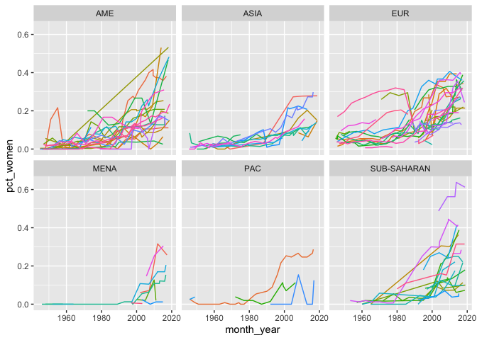

Women in Parliament
================
Natalie Gable
4/12/2021

  - [Data Import](#data-import)
  - [Current (March 2021) Data](#current-march-2021-data)
  - [Historical Data](#historical-data)

## Data Import

``` r
current_data <- 
  march2021_file %>% 
  read_csv(
    skip = 5
  ) %>% 
  transmute(
    country = X2,
    total_seats = if_else(`Seats*` == '-', NA_character_, `Seats*`) %>% 
      as.integer(),
    n_women = if_else(Women == '-', NA_character_, Women) %>% 
      as.integer(),
    n_men = total_seats - n_women,
    pct_women = n_women / total_seats,
    pct_men = n_men / total_seats
  )
```

    ## Warning: Missing column names filled in: 'X1' [1], 'X2' [2]

    ## Warning: Duplicated column names deduplicated: 'Elections' => 'Elections_1' [7],
    ## 'Seats*' => 'Seats*_1' [8], 'Women' => 'Women_1' [9], '% W' => '% W_1' [10]

    ## Parsed with column specification:
    ## cols(
    ##   X1 = col_character(),
    ##   X2 = col_character(),
    ##   Elections = col_character(),
    ##   `Seats*` = col_character(),
    ##   Women = col_character(),
    ##   `% W` = col_character(),
    ##   Elections_1 = col_character(),
    ##   `Seats*_1` = col_character(),
    ##   Women_1 = col_character(),
    ##   `% W_1` = col_character()
    ## )

``` r
historical_df_lower <-
  historical_file %>% 
  read_xlsx() %>% 
  filter(`Chamber Type` == 'Lower') %>% 
  select(Country, Region, Year, Month, `Chamber Total Seats`, `Total women`)

historical_df_upper <-
  historical_file %>% 
  read_xlsx() %>% 
  filter(`Chamber Type` == 'Upper') %>% 
  select(Country, Region, Year, Month, `Chamber Total Seats`, `Total women`)

historical_df_lower %>% 
  summary()
```

    ##    Country             Region               Year         Month          
    ##  Length:1014        Length:1014        Min.   :1945   Length:1014       
    ##  Class :character   Class :character   1st Qu.:1968   Class :character  
    ##  Mode  :character   Mode  :character   Median :1992   Mode  :character  
    ##                                        Mean   :1987                     
    ##                                        3rd Qu.:2006                     
    ##                                        Max.   :2018                     
    ##  Chamber Total Seats Total women       
    ##  Length:1014         Length:1014       
    ##  Class :character    Class :character  
    ##  Mode  :character    Mode  :character  
    ##                                        
    ##                                        
    ## 

``` r
historical_df_upper %>% 
  summary()
```

    ##    Country             Region               Year         Month          
    ##  Length:1180        Length:1180        Min.   :1945   Length:1180       
    ##  Class :character   Class :character   1st Qu.:1970   Class :character  
    ##  Mode  :character   Mode  :character   Median :1992   Mode  :character  
    ##                                        Mean   :1988                     
    ##                                        3rd Qu.:2006                     
    ##                                        Max.   :2018                     
    ##  Chamber Total Seats Total women       
    ##  Length:1180         Length:1180       
    ##  Class :character    Class :character  
    ##  Mode  :character    Mode  :character  
    ##                                        
    ##                                        
    ## 

## Current (March 2021) Data

``` r
current_data %>% 
  drop_na() %>% 
  mutate(percent_women = pct_women) %>% 
  gather(pct_women, pct_men, key = 'gender', value = 'pct') %>% 
  mutate_at(vars(gender), ~str_replace(., 'pct_', '')) %>% 
  ggplot(mapping = aes(x = fct_reorder(country, percent_women), y = pct, fill = gender)) +
  geom_col() + 
  coord_flip() +
  theme_minimal() +
  theme(
    axis.text.y = element_text(size = 3),
    aspect.ratio = 1
  )
```

<!-- -->

Refine this visualization:

``` r
labels <- 
  current_data %>% 
  drop_na() %>% 
  mutate(percent_women = pct_women) %>%
  arrange(desc(percent_women)) %>% 
  slice(1:25) %>% 
  gather(pct_women, pct_men, key = 'gender', value = 'pct') %>% 
  mutate(percent_women = 100 * round(percent_women, 2)) %>% 
  pull(percent_women) %>% 
  map_chr(~str_c(., '%'))

current_data %>% 
  drop_na() %>% 
  mutate(percent_women = pct_women) %>%
  arrange(desc(percent_women)) %>% 
  slice(1:25) %>% 
  gather(pct_women, pct_men, key = 'gender', value = 'pct') %>% 
  mutate_at(
    vars(gender), 
    ~str_replace(., 'pct_', '') %>% 
      str_to_title()
  ) %>% 
  ggplot(
    mapping = aes(
      x = fct_reorder(country, percent_women), 
      y = pct, 
      fill = gender
    )
  ) +
  geom_col() + 
  geom_label(
    aes(
      x = fct_reorder(country, percent_women), 
      y = percent_women + 0.05, 
      label = labels
    ),
    fill = NA,
    color = 'white',
    label.size = NA,
    size = 2
  ) +
  coord_flip() +
  geom_hline(aes(yintercept = 0.5), color = 'white', linetype = 'dotted') + 
  scale_y_continuous(labels = scales::percent) + 
  theme_minimal() +
  theme(
    axis.text.y = element_text(size = 8),
    aspect.ratio = 0.7,
    panel.background = element_rect(fill = 'white'),
    panel.grid = element_blank()
  ) + 
  labs(
    title = 'Top 25 Countries* by Percent Women in Parliament',
    subtitle = 'For lower parliaments in each country',
    caption = 'Source: Inter-Parliamentary Union \n *Excluding Ecuador, Eritrea, Haiti, Sudan (missing data)',
    y = 'Percent Breakdown of Parliament',
    x = '',
    fill = ''
  )
```

<!-- -->

``` r
labels_bottom <- 
  current_data %>% 
  drop_na() %>% 
  mutate(percent_women = pct_women) %>%
  arrange(percent_women) %>% 
  slice(1:25) %>% 
  gather(pct_women, pct_men, key = 'gender', value = 'pct') %>% 
  mutate(percent_women = 100 * round(percent_women, 2)) %>% 
  pull(percent_women) %>% 
  map_chr(~str_c(., '%'))

current_data %>% 
  drop_na() %>% 
  mutate(percent_women = pct_women) %>%
  arrange(percent_women) %>% 
  slice(1:25) %>% 
  gather(pct_women, pct_men, key = 'gender', value = 'pct') %>% 
  mutate_at(
    vars(gender), 
    ~str_replace(., 'pct_', '') %>% 
      str_to_title()
  ) %>% 
  ggplot(
    mapping = aes(
      x = fct_reorder(country, percent_women), 
      y = pct, 
      fill = gender
    )
  ) +
  geom_col() + 
  geom_label(
    aes(
      x = fct_reorder(country, percent_women), 
      y = percent_women + 0.05, 
      label = labels_bottom
    ),
    fill = NA,
    color = 'white',
    label.size = NA,
    size = 2
  ) +
  coord_flip() +
  geom_hline(aes(yintercept = 0.5), color = 'white', linetype = 'dotted') + 
  scale_y_continuous(labels = scales::percent) + 
  theme_minimal() +
  theme(
    axis.text.y = element_text(size = 8),
    aspect.ratio = 0.7,
    panel.background = element_rect(fill = 'white'),
    panel.grid = element_blank()
  ) + 
  labs(
    title = 'Bottom 25 Countries* by Percent Women in Parliament',
    subtitle = 'For lower parliaments in each country',
    caption = 'Source: Inter-Parliamentary Union \n *Excluding Ecuador, Eritrea, Haiti, Sudan (missing data)',
    y = 'Percent Breakdown of Parliament',
    x = '',
    fill = ''
  )
```

<!-- -->

## Historical Data

``` r
historical_df_lower %>% 
  mutate(
    Month = if_else(is.na(Month), '01', Month),
    month_year = ymd(str_c(Year, Month, '01', sep = '-')),
    pct_women = as.integer(`Total women`) / as.integer(`Chamber Total Seats`)
  ) %>% 
  drop_na() %>% 
  ggplot(mapping = aes(x = month_year, y = pct_women, color = Country)) + 
  geom_line() + 
  facet_wrap(vars(Region)) +
  theme(
    legend.position = 'none'
  )
```

    ## Warning: Problem with `mutate()` input `month_year`.
    ## ℹ  2 failed to parse.
    ## ℹ Input `month_year` is `ymd(str_c(Year, Month, "01", sep = "-"))`.

    ## Warning: 2 failed to parse.

    ## Warning: Problem with `mutate()` input `pct_women`.
    ## ℹ NAs introduced by coercion
    ## ℹ Input `pct_women` is `as.integer(`Total women`)/as.integer(`Chamber Total Seats`)`.

    ## Warning in mask$eval_all_mutate(dots[[i]]): NAs introduced by coercion

    ## Warning: Problem with `mutate()` input `pct_women`.
    ## ℹ NAs introduced by coercion
    ## ℹ Input `pct_women` is `as.integer(`Total women`)/as.integer(`Chamber Total Seats`)`.

    ## Warning in mask$eval_all_mutate(dots[[i]]): NAs introduced by coercion

<!-- -->

``` r
historical_df_lower %>% 
  filter(Region == 'AME') %>% 
  mutate(
    Month = if_else(is.na(Month), '01', Month),
    month_year = ymd(str_c(Year, Month, '01', sep = '-')),
    pct_women = as.integer(`Total women`) / as.integer(`Chamber Total Seats`)
  ) %>% 
  drop_na() %>% 
  ggplot(mapping = aes(x = month_year, y = pct_women, color = Country)) + 
  geom_line()
```

    ## Warning: Problem with `mutate()` input `pct_women`.
    ## ℹ NAs introduced by coercion
    ## ℹ Input `pct_women` is `as.integer(`Total women`)/as.integer(`Chamber Total Seats`)`.

    ## Warning in mask$eval_all_mutate(dots[[i]]): NAs introduced by coercion

<!-- -->

``` r
historical_df_lower %>% 
  filter(Country == 'Rwanda') %>% 
  mutate(
    Month = if_else(is.na(Month), '01', Month),
    month_year = ymd(str_c(Year, Month, '01', sep = '-')),
    pct_women = as.integer(`Total women`) / as.integer(`Chamber Total Seats`)
  ) %>% 
  ggplot(mapping = aes(x = month_year, y = pct_women)) + 
  geom_point()
```

<!-- -->

``` r
historical_df_upper %>% 
  filter(Country == 'Rwanda') %>% 
  mutate(
    Month = if_else(is.na(Month), '01', Month),
    month_year = ymd(str_c(Year, Month, '01', sep = '-')),
    pct_women = as.integer(`Total women`) / as.integer(`Chamber Total Seats`)
  ) %>% 
  ggplot(mapping = aes(x = month_year, y = pct_women)) + 
  geom_point()
```

<!-- -->

``` r
historical_df_lower %>% 
  filter(Country == 'United States of America') %>% 
  mutate(
    Month = if_else(is.na(Month), '01', Month),
    month_year = ymd(str_c(Year, Month, '01', sep = '-')),
    pct_women = as.integer(`Total women`) / as.integer(`Chamber Total Seats`)
  ) %>% 
  ggplot(mapping = aes(x = month_year, y = pct_women)) + 
  geom_point()
```

<!-- -->

``` r
historical_df_upper %>% 
  filter(Country == 'United States of America') %>% 
  mutate(
    Month = if_else(is.na(Month), '01', Month),
    month_year = ymd(str_c(Year, Month, '01', sep = '-')),
    pct_women = as.integer(`Total women`) / as.integer(`Chamber Total Seats`)
  ) %>% 
  ggplot(mapping = aes(x = month_year, y = pct_women)) + 
  geom_point()
```

<!-- -->
